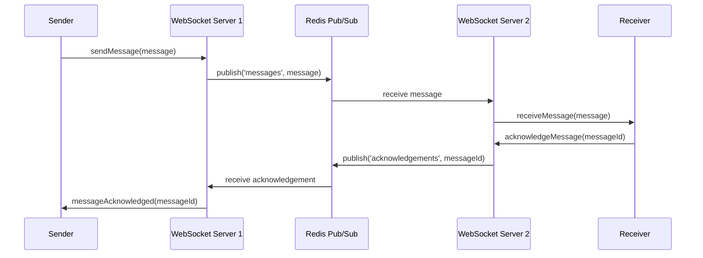
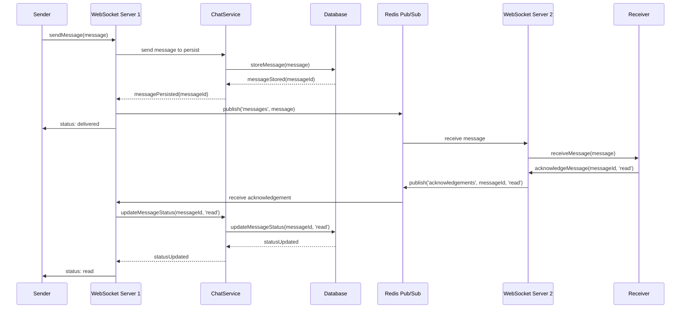

# Diagrams

## 2 websocket servers

```mermaid
sequenceDiagram
    participant Sender
    participant Server1 as WebSocket Server 1
    participant Redis as Redis Pub/Sub
    participant Server2 as WebSocket Server 2
    participant Receiver

    Sender->>Server1: sendMessage(message)
    Server1->>Redis: publish('messages', message)
    Redis->>Server2: receive message
    Server2->>Receiver: receiveMessage(message)
    Receiver->>Server2: acknowledgeMessage(messageId)
    Server2->>Redis: publish('acknowledgements', messageId)
    Redis->>Server1: receive acknowledgement
    Server1->>Sender: messageAcknowledged(messageId)

```

## Persist messages

```mermaid
sequenceDiagram
    participant Sender
    participant Server1 as WebSocket Server 1
    participant ChatService
    participant DB as Database
    participant Redis as Redis Pub/Sub
    participant Server2 as WebSocket Server 2
    participant Receiver

    Sender->>Server1: sendMessage(message)
    Server1->>ChatService: send message to persist
    ChatService->>DB: storeMessage(message)
    DB-->>ChatService: messageStored(messageId)
    ChatService-->>Server1: messagePersisted(messageId)
    Server1->>Redis: publish('messages', message)
    Server1->>Sender: status: delivered
    Redis->>Server2: receive message
    Server2->>Receiver: receiveMessage(message)
    Receiver->>Server2: acknowledgeMessage(messageId, 'read')
    Server2->>Redis: publish('acknowledgements', messageId, 'read')
    Redis->>Server1: receive acknowledgement
    Server1->>ChatService: updateMessageStatus(messageId, 'read')
    ChatService->>DB: updateMessageStatus(messageId, 'read')
    DB-->>ChatService: statusUpdated
    ChatService-->>Server1: statusUpdated
    Server1->>Sender: status: read

```