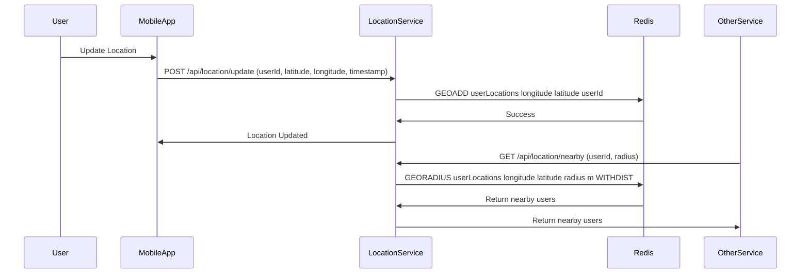

## Diagram

```mermaid
sequenceDiagram
    participant User
    participant MobileApp
    participant LocationService
    participant Redis
    participant OtherService

    User ->> MobileApp: Update Location
    MobileApp ->> LocationService: POST /api/location/update (userId, latitude, longitude, timestamp)
    LocationService ->> Redis: GEOADD userLocations longitude latitude userId
    Redis ->> LocationService: Success
    LocationService ->> MobileApp: Location Updated

    OtherService ->> LocationService: GET /api/location/nearby (userId, radius)
    LocationService ->> Redis: GEORADIUS userLocations longitude latitude radius m WITHDIST
    Redis ->> LocationService: Return nearby users
    LocationService ->> OtherService: Return nearby users

```